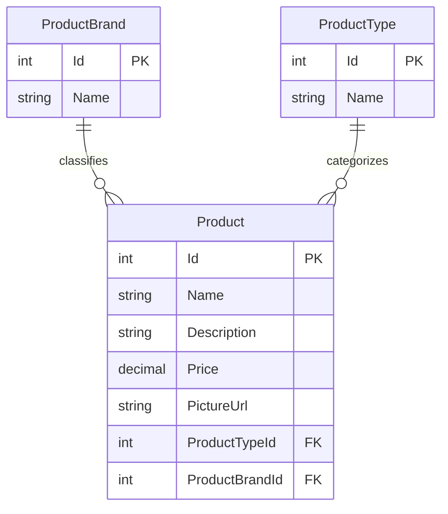
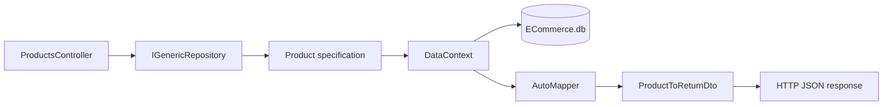

# Database Documentation

## 1. Overview

The ECommerce API uses Entity Framework Core with SQLite. The database file is `API/ECommerce.db`, and the configured connection string is:

```text
Data source=ECommerce.db
```

The database is created and upgraded automatically when the API starts. `Program.cs` calls `Database.MigrateAsync()` and then runs the seed process.

## 2. Database technology

| Area | Technology |
|---|---|
| Database engine | SQLite |
| ORM | Entity Framework Core |
| Migration project | `Infrastructure` |
| DbContext | `Infrastructure.Data.DataContext` |
| Database file | `API/ECommerce.db` |
| Decimal handling | SQLite decimal properties are converted to `double` by `DataContext` |

## 3. Entity relationship diagram



### Relationship cardinality

- One `ProductBrand` can be associated with zero or many `Product` records.
- One `ProductType` can be associated with zero or many `Product` records.
- Every `Product` requires one brand and one type because both foreign-key properties are non-nullable integers.
- Deleting a brand or type cascades to its products according to the initial migration.

## 4. Tables

### 4.1 `ProductBrands`

| Column | SQLite type | Nullability | Key | Description |
|---|---|---:|---|---|
| `Id` | `INTEGER` | Not null | Primary key, autoincrement | Unique brand identifier |
| `Name` | `TEXT` | Nullable in current migration | None | Display name of the brand |

Entity: `Core.Entities.ProductBrand`.

### 4.2 `ProductTypes`

| Column | SQLite type | Nullability | Key | Description |
|---|---|---:|---|---|
| `Id` | `INTEGER` | Not null | Primary key, autoincrement | Unique type identifier |
| `Name` | `TEXT` | Nullable in current migration | None | Display name of the product type |

Entity: `Core.Entities.ProductType`.

### 4.3 `Products`

| Column | SQLite type | Nullability | Key | Description |
|---|---|---:|---|---|
| `Id` | `INTEGER` | Not null | Primary key, autoincrement | Unique product identifier |
| `Name` | `TEXT` | Not null, max length 100 | None | Product name |
| `Description` | `TEXT` | Not null | None | Product description |
| `Price` | `decimal(18,2)` | Not null | None | Product price |
| `PictureUrl` | `TEXT` | Not null | None | Image path or URL |
| `ProductTypeId` | `INTEGER` | Not null | Foreign key | References `ProductTypes.Id` |
| `ProductBrandId` | `INTEGER` | Not null | Foreign key | References `ProductBrands.Id` |

Entity: `Core.Entities.Product`.

## 5. Indexes and constraints

The initial migration creates:

- Primary key `PK_ProductBrands` on `ProductBrands.Id`.
- Primary key `PK_ProductTypes` on `ProductTypes.Id`.
- Primary key `PK_Products` on `Products.Id`.
- Index `IX_Products_ProductBrandId` on `Products.ProductBrandId`.
- Index `IX_Products_ProductTypeId` on `Products.ProductTypeId`.
- Foreign key `FK_Products_ProductBrands_ProductBrandId`.
- Foreign key `FK_Products_ProductTypes_ProductTypeId`.

The migration currently defines cascade delete for both product foreign keys. For production systems, review this behavior before allowing deletion of a brand or type because deleting a classification can delete all related products.

## 6. Data access flow



The product controller supports:

| Endpoint | Database operation |
|---|---|
| `GET /api/products` | Filtered and paginated product query with brand/type relationships |
| `GET /api/products/{id}` | Single product query with brand/type relationships |
| `GET /api/products/brands` | Read all product brands |
| `GET /api/products/types` | Read all product types |

## 7. Migrations

Run commands from the repository root or specify the project paths explicitly.

### List migrations

```powershell
dotnet ef migrations list --project Infrastructure --startup-project API
```

### Add a migration

```powershell
dotnet ef migrations add MigrationName --project Infrastructure --startup-project API
```

### Apply migrations

```powershell
dotnet ef database update --project Infrastructure --startup-project API
```

### Revert the latest migration during development

```powershell
dotnet ef migrations remove --project Infrastructure --startup-project API
```

Do not remove an already-applied production migration. Create a new corrective migration instead.

## 8. Seeding

Seed data is stored in `Infrastructure/Data/SeedData`:

- `brands.json`
- `delivery.json`

The application executes `StoreContextSeed.SeedAsync(context)` during startup. Seeding should be idempotent so that restarting the API does not create duplicate reference data.

## 9. Backup and reset

### Backup

Stop the API before copying the SQLite database to ensure all writes are flushed:

```powershell
Copy-Item API/ECommerce.db API/ECommerce.db.backup
```

SQLite sidecar files may also exist while the database is open:

- `ECommerce.db-shm`
- `ECommerce.db-wal`

### Reset development data

Stop the API, remove `API/ECommerce.db`, and start the API again. The migration and seed process will recreate the database.

```powershell
Remove-Item API/ECommerce.db -ErrorAction SilentlyContinue
Remove-Item API/ECommerce.db-shm -ErrorAction SilentlyContinue
Remove-Item API/ECommerce.db-wal -ErrorAction SilentlyContinue
```

Only perform this reset against local development data.

## 10. Recommended database improvements

The current schema is appropriate for the product catalog prototype. Before production use, consider:

1. Make `ProductBrands.Name` and `ProductTypes.Name` non-nullable.
2. Add unique indexes for brand and type names.
3. Add validation for non-negative product prices.
4. Review cascade deletes and consider restricted deletes.
5. Add created/updated timestamps and optimistic concurrency if products are edited by multiple users.
6. Add tables for users, addresses, carts, orders, order lines, and payments when checkout is implemented.
7. Move database credentials and environment-specific paths to environment configuration.
8. Add automated migration and backup procedures for deployment environments.
