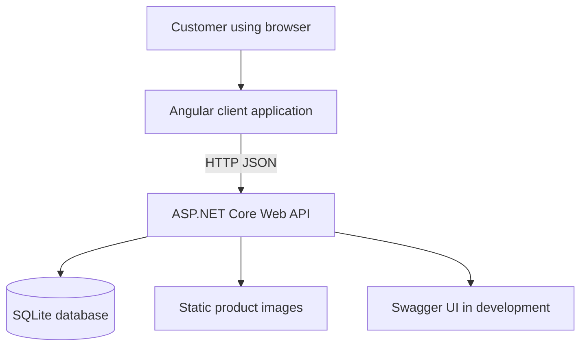
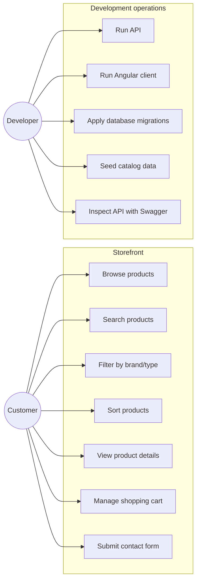
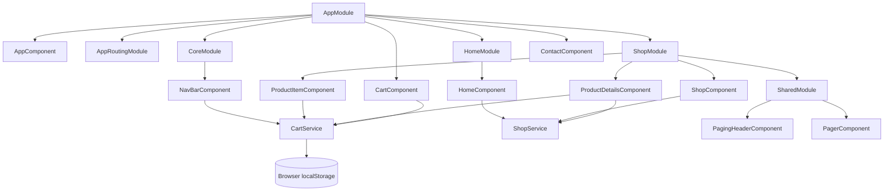
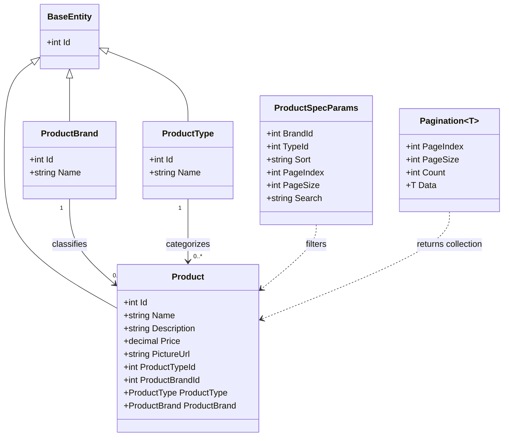
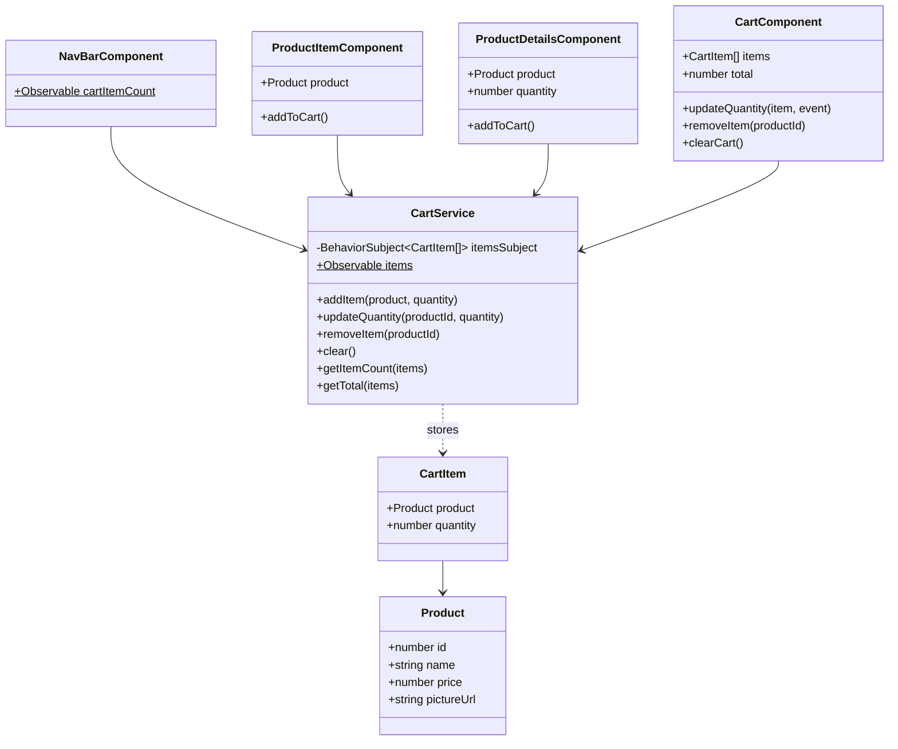
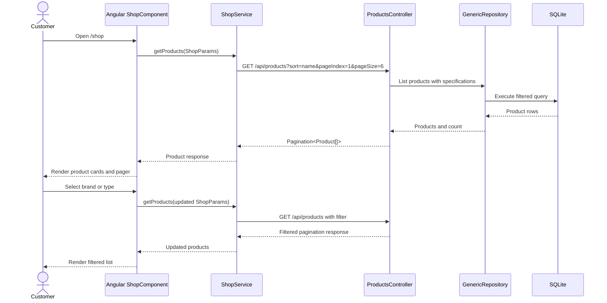
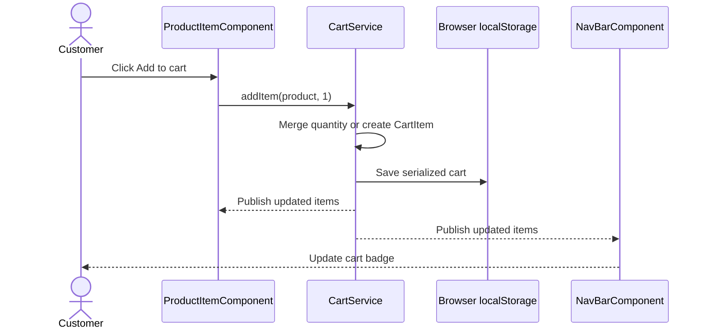
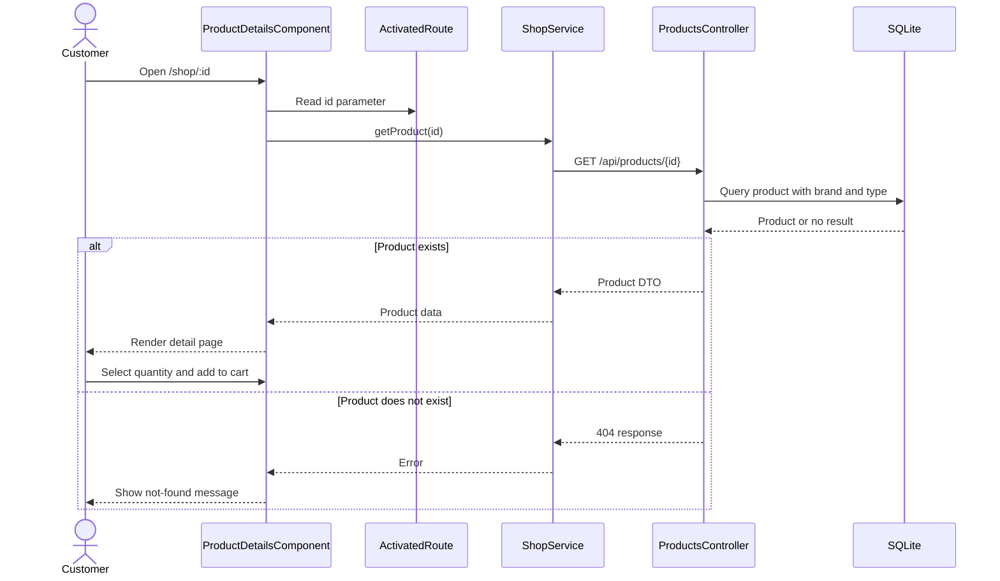
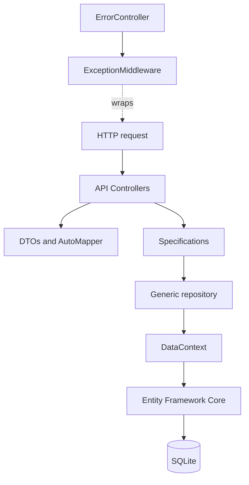

# UML and Architecture Documentation

## 1. Scope

This document describes the current ECommerce system as implemented by the ASP.NET Core API, the Angular client, and the SQLite data store. The diagrams use Mermaid syntax so they can be rendered in GitHub, Visual Studio extensions, Mermaid Live, or other compatible Markdown viewers.

## 2. System context



### Main responsibilities

| Subsystem | Responsibilities |
|---|---|
| Angular client | Navigation, product search/filtering, pagination, product details, local cart, contact form |
| ASP.NET Core API | Product catalog endpoints, filtering, pagination, mapping, errors, CORS, migrations, seeding |
| Core project | Domain entities, repository/specification interfaces, shared business abstractions |
| Infrastructure project | EF Core `DataContext`, repositories, specifications, migrations, seed data |
| SQLite | Product, brand, and type persistence |

## 3. Actors and use cases



## 4. Angular component/module structure



## 5. Angular route diagram

```mermaid
flowchart LR
	Root[Browser root] --> Home[/]
	Root --> Shop[/shop]
	Root --> Details[/shop/:id]
	Root --> Cart[/cart]
	Root --> Contact[/contact]
	Root --> Fallback[Unknown route]
	Fallback --> Home
```

| Route | Component | Purpose |
|---|---|---|
| `/` | `HomeComponent` | Hero section and featured products |
| `/shop` | `ShopComponent` | Product catalog, filtering, sorting, search, pagination |
| `/shop/:id` | `ProductDetailsComponent` | Product details and quantity selection |
| `/cart` | `CartComponent` | Cart contents, quantities, totals, and removal |
| `/contact` | `ContactComponent` | Client-side contact form presentation |
| `**` | Redirect to `/` | Fallback for unknown routes |

## 6. Domain class diagram



## 7. Client-side cart class diagram



## 8. Product browsing sequence



## 9. Add-to-cart sequence



## 10. Product details sequence



## 11. API layering



## 12. Design notes and current limitations

- The cart is client-side only and persists in browser local storage.
- Login, registration, authorization, checkout, payments, orders, and server-side carts are not implemented.
- The contact form currently displays a success state locally; it does not submit to an API endpoint.
- Swagger is enabled only in the ASP.NET development environment.
- Product catalog data is the primary persisted domain currently represented by the database.
- The diagrams describe the current implementation and should be updated whenever routes, domain entities, or API contracts change.
